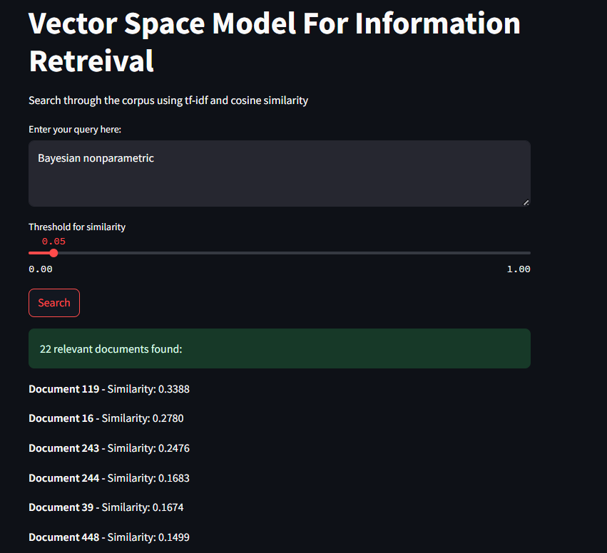
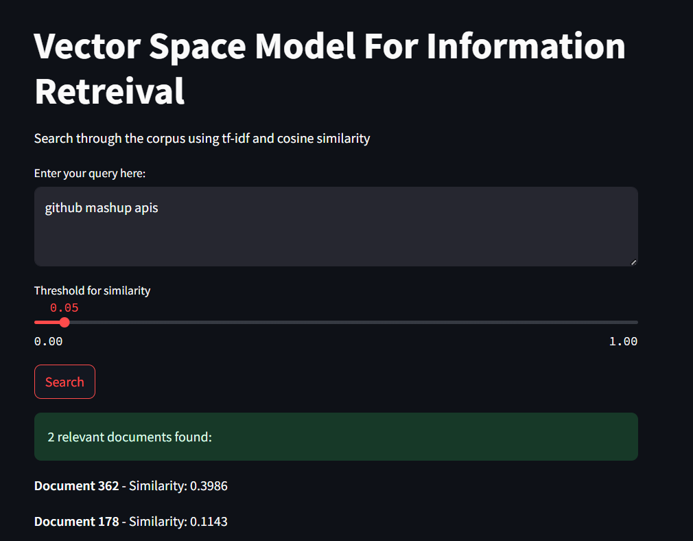

# Vector Space Model for Information Retrieval 

This project implements a **Vector Space Model (VSM)** for retrieving relevant documents from a corpus of scientific abstracts based on user queries. It includes a fully functional **Streamlit GUI** for intuitive search, ranking, and result exploration.

## Overview

- Preprocesses raw text documents using:
  - Case folding
  - Tokenization
  - Stopword removal
  - Lemmatization
- Constructs an **inverted index** that stores term frequency (TF) and document frequency (DF)
- Computes **TF-IDF** weights for terms in each document. The TF is also normalised to ensure similarity values are in range 0-1
- Processes user queries using cosine similarity
- Displays top-ranked documents based on similarity scores
- The list of documents can be filtered with an alpha value say (alpha= 0.05),
- Supports free-text queries through an interactive GUI
## Dataset

The dataset contains **448 scientific abstracts** from computer science journals. Each abstract is treated as a separate document for indexing and retrieval.

## GUI Demonstration over a few gold queries in the **Gold Query-VSM.txt** file. 

##  Key Features

- **Efficient IR** using cosine similarity and sparse vector operations
- Clean, modular code structure
- Interactive and easy-to-use UI with Streamlit
- Suitable for testing IR techniques on small/medium datasets

